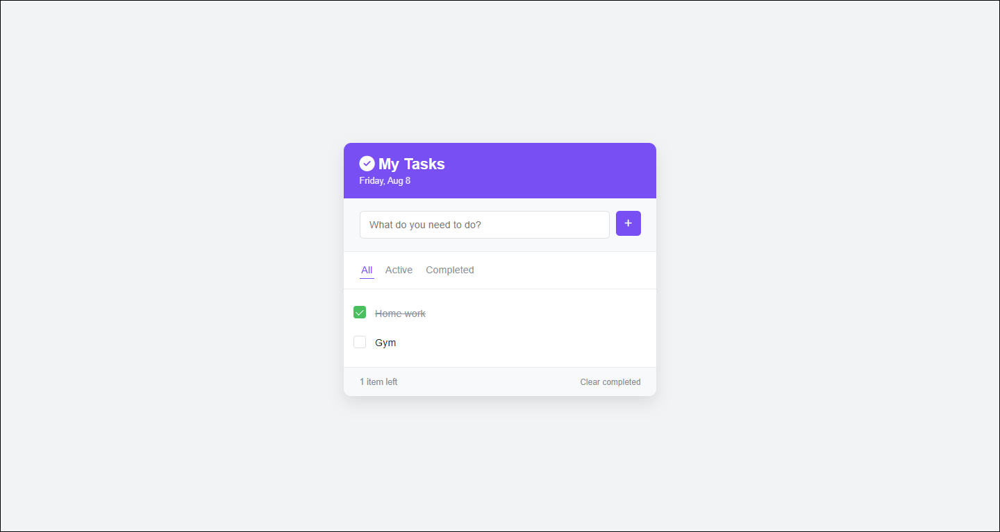

# 📝 Todo App

A simple and clean Todo List web application built with **HTML**, **CSS**, and **JavaScript**.

## ✅ Features

- Add new tasks
- Mark tasks as complete
- Delete individual tasks
- Responsive and minimalist design
- Fully client-side, no backend required

## 🎯 Goals

This project was built to improve my JavaScript and DOM manipulation skills, as part of my learning journey in web development.

## 🚀 Live Demo

Check out the app live here:  
🔗 [https://abdarrhmanessetaoui.github.io/Todo-App/](https://abdarrhmanessetaoui.github.io/Todo-App/)

## 🛠️ Tech Stack

- HTML
- CSS
- JavaScript

## 📷 Preview



## 📁 How to Use Locally

1. Clone the repository:
   ```bash
   git clone https://github.com/abdarrhmanessetaoui/Todo-App.git
